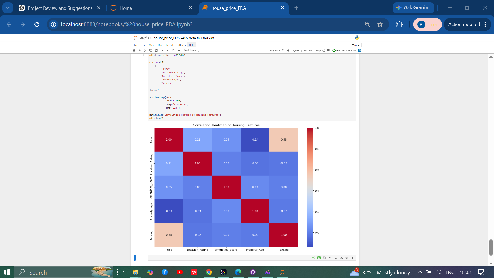
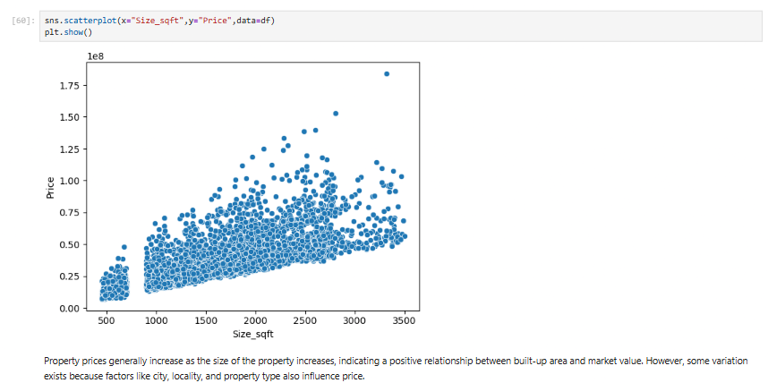

# 🏠 House Price Prediction – Exploratory Data Analysis (EDA)

## 📌 Project Overview

House prices are influenced by several factors such as location, area, amenities, and property condition. This project performs **Exploratory Data Analysis (EDA)** on an Indian House Price dataset to understand these relationships and uncover meaningful insights from the data.

The project focuses on cleaning the dataset, analyzing feature relationships, detecting outliers, and visualizing patterns that can help prepare the data for future machine learning models.

---
## 📊 Dataset

- Dataset: Indian House Price Dataset
- Records:5000
- Features:10+
- Target Variable:House Price

## 🎯 Objectives

- Understand the structure of the housing dataset.
- Clean and preprocess the data.
- Detect missing values and duplicates.
- Explore individual features and their distributions.
- Analyze relationships between different variables.
- Identify factors that influence house prices.
- Prepare the dataset for predictive modeling.

---

## 📂 Dataset Features

The dataset contains information about residential properties, including:
- City
- BHK
- Area (Square Feet)
- Location Rating
- hospital_distance
- school_distance
- Amenities Score
- Property Age
- Parking Availability
- Furnishing Status
- House Price (Target Variable)

---

## 🛠️ Technologies Used

- Python
- Pandas
- NumPy
- Matplotlib
- Seaborn
- Jupyter Notebook

---

## 📊 Exploratory Data Analysis

The following analyses were performed:

- Data Cleaning
- Missing Value Analysis
- Duplicate Removal
- Univariate Analysis
- Bivariate Analysis
- Correlation Analysis
- Heatmap Visualization
- Boxplots
- Histograms
- Scatter Plots
- Outlier Detection
- Feature Relationship Analysis

---

## 📈 Key Insights

Some important observations from the analysis include:

- 📈 Property area has one of the strongest positive relationships with house price.
- 📍 Houses in premium locations generally have higher prices.
- 🏠 Larger homes tend to be more expensive.
- 🚗 Parking availability positively impacts property prices.
- 🛋️ Furnished houses usually command higher prices than unfurnished ones.
- 📊 A few luxury properties were identified as outliers during analysis.

---
## 📌 Results

The exploratory analysis identified the most influential factors affecting house prices, including property area, location rating, parking availability, and furnishing status. The analysis also revealed the presence of outliers and feature correlations that can support future predictive modeling.

## 🖼️ Sample Visualizations

### Correlation Heatmap
This heatmap shows the correlation between key housing features and house prices, helping identify which variables have the strongest relationships.



---

### House Price Distribution
This histogram illustrates how house prices are distributed across the dataset and highlights the overall pricing pattern.


---

### 🏠 House Size vs House Price

This scatter plot shows the relationship between **house size (square feet)** and **house price**, indicating that larger houses generally tend to have higher prices.




---

## 📁 Project Structure

```text
house-price-prediction-eda/
│
├── House-price-EDA.ipynb
├── Indian_House_PriceDataset.csv
├── README.md
├── requirements.txt
├── .gitignore
├── .gitattributes
└── images/
    ├── Heatmap.png
    ├── distribution_price.png
    └── size_sqft_vs_price.png

---

## 🚀 Getting Started

### Clone the repository

```bash
git clone https://github.com/riyasingla121/house-price-prediction-eda.git
```

### Navigate to the project folder

```bash
cd house-price-prediction-eda
```

### Install the required libraries

```bash
pip install -r requirements.txt
```

### Open the notebook

```bash
jupyter notebook
```

---

## 🔮 Future Improvements

This project can be extended by:

- Feature Engineering
- Feature Scaling
- Linear Regression
- Decision Tree Regressor
- Random Forest Regressor
- Model Comparison
- Hyperparameter Tuning
- Streamlit Web Application for House Price Prediction

---

## ✅ Conclusion

This project demonstrates how Exploratory Data Analysis can uncover meaningful patterns in housing data and identify the key factors affecting property prices.

The insights gained from this analysis provide a strong foundation for building accurate machine learning models for house price prediction.

---

## 👩‍💻 Author

**Riya Singla**

## 🔗 Related Project

This EDA project serves as the foundation for my Machine Learning project, where predictive models are trained to estimate house prices.

➡️ **House Price Prediction – Machine Learning:**  
https://github.com/riyasingla121/house-price-prediction-ml

Aspiring Data Analyst | Python | SQL | Machine Learning

---

⭐ If you found this project helpful, consider giving it a **Star**.
